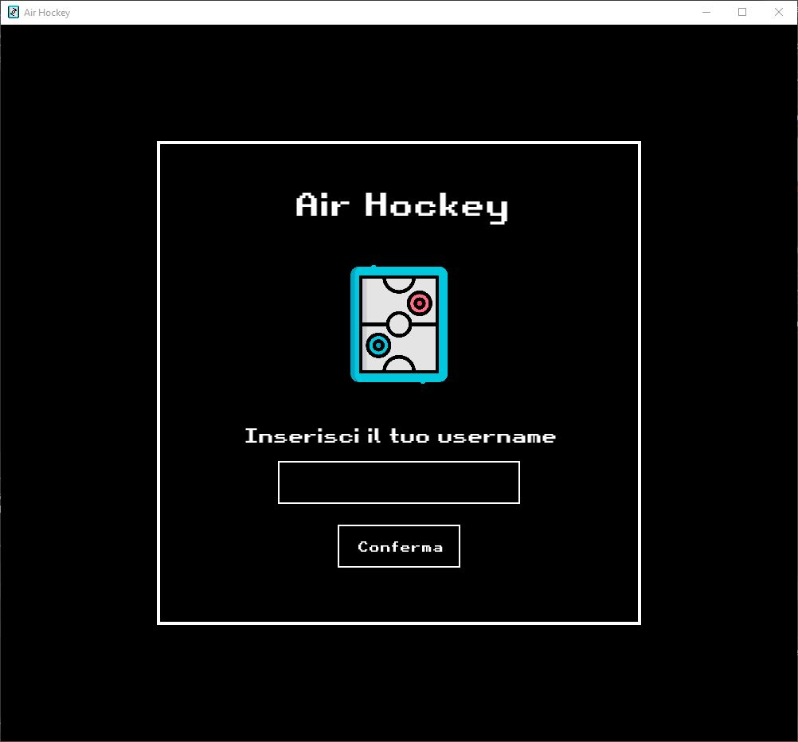
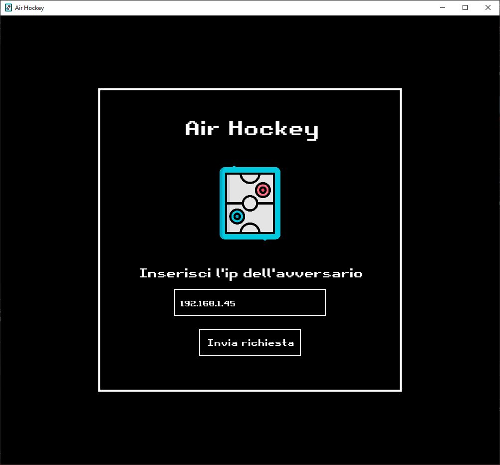
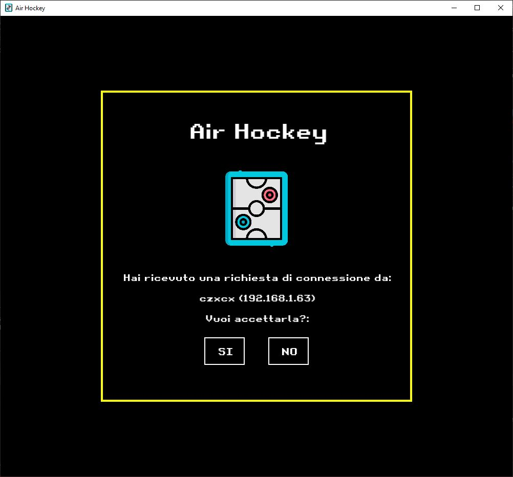
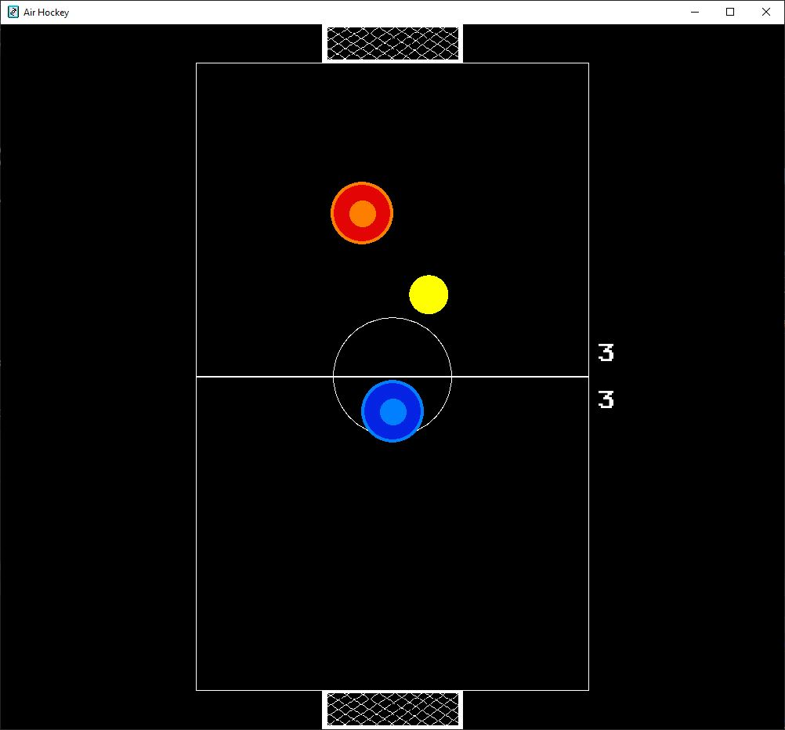
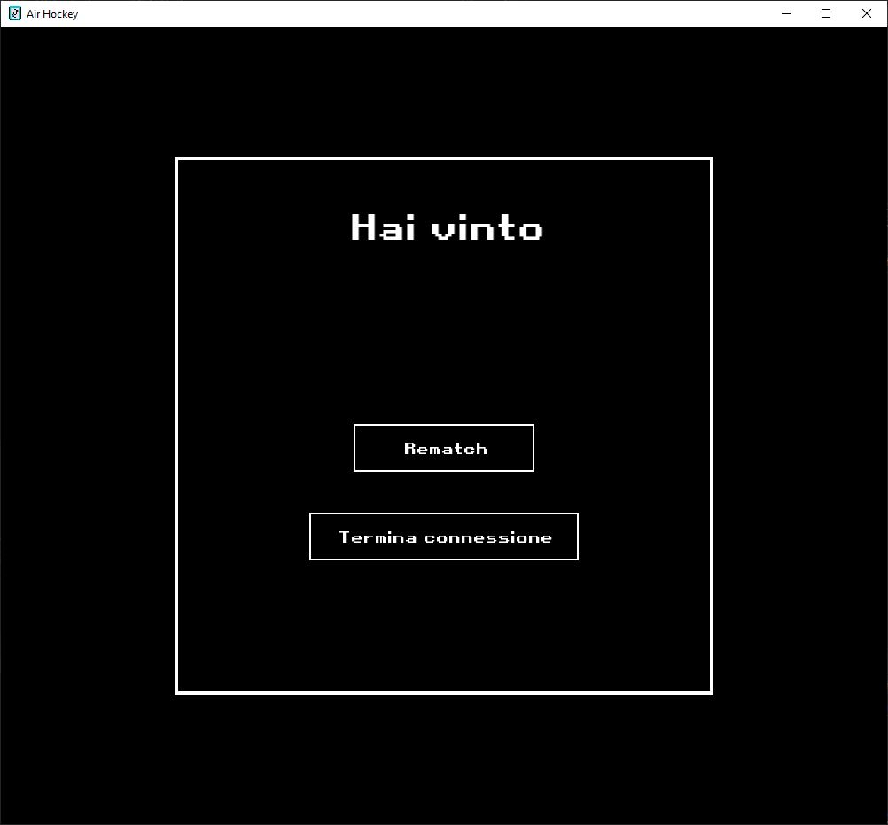

# AirHockey
Gioco Air Hockey in versione p2p utilizzando il protocollo UDP.
## Pages
### Page set username
Questa è la pagina che permette di impostare il proprio username all'interno del gioco, per poterlo cambiare sarà necessario chiudere e riaprire l'applicazione.

### Page Send Request
Questa è la pagina che permette all'utente di inviare la richiesta per giocare ad un altro host inserendo l'ip dell'avversario e cliccando sul pulsante

### Page Accept Request
Questa è la pagina che permette all'utente di accettare/rifiutare una richiesta che arriva da un altro host

### Game Page
Questa è la pagina che visualizza il campo da gioco, le manopole e il dischetto e permette all'utente di giocare

### End Page
Questa è la pagina che compare dopo la fine della partita tramite la quale i giocatori possono fare un'altra partita oppure chiudere la connessione

